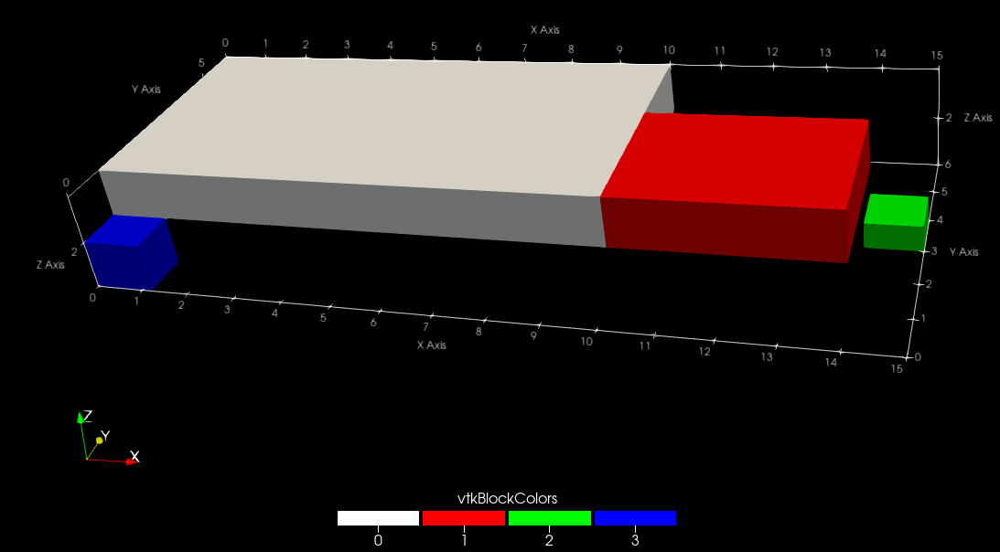

# Multiblock files

Multiblock files (`.vtm`) are XML VTK files that can point to multiple other VTK
files.
They can be useful when working with complex geometries that are composed of
multiple sub-domains.

To generate a multiblock file, it must first be initialised using [`vtk_multiblock`](@ref):

``` julia
vtm = vtk_multiblock("my_vtm_file")
```

Then, each sub-grid can be generated with [`vtk_grid`](@ref) using `vtm`
as the first argument:

``` julia
# First block.
vtk = vtk_grid(vtm, x1, y1, z1)
    vtk["Pressure"] = p1
end

# Second block.
let vtk = vtk_grid(vtm, x2, y2, z2)
    vtk["Pressure"] = p2
end
```

Additional blocks can also be added to the multiblock file with
`multiblock_add_block`, which can contain any of the VTK files that WriteVTK
supports:

```julia
# Create a block named "my_multiblock" and add it to `vtm`.
block = multiblock_add_block(vtm, "my_multiblock")

# Add a VTK file to `block`.
let vtk = vtk_grid(block, "another_file", x3, y3, z3)
    vtk["Pressure"] = p3
end
```

Blocks can be nested arbitrarily:

```julia
# Add more blocks.
another_block = multiblock_add_block(block, "my_multiblock-block")
yet_another_block = multiblock_add_block(another_block, "my_multiblock-block-block")
```

And more VTK files may be added to the sub-blocks:

```julia
vtk = vtk_grid(yet_another_block, "my_deeply_nested_file", x4, y4, z4)
```

Finally, only the multiblock file needs to be saved explicitly:

``` julia
outfiles = vtk_save(vtm)
```

WriteVTK will write out a multiblock VTK file that looks like something like this (in addition to all the VTK files contained in the multiblock file):

```xml
<?xml version="1.0" encoding="utf-8"?>
<VTKFile type="vtkMultiBlockDataSet" version="1.0" byte_order="LittleEndian">
  <vtkMultiBlockDataSet>
    <DataSet index="0" file="my_vtm_file_1.vti"/>
    <DataSet index="1" file="my_vtm_file_2.vti"/>
    <Block index="2" name="my_multiblock">
      <DataSet index="0" file="another_file.vti" name="another_file"/>
      <Block index="1" name="my_multiblock-block">
        <Block index="0" name="my_multiblock-block-block">
          <DataSet index="0" file="my_deeply_nested_file.vti" name="my_deeply_nested_file"/>
        </Block>
      </Block>
    </Block>
  </vtkMultiBlockDataSet>
</VTKFile>
```

## Working example

The full above example may also be written using the do-block syntax as follows:

```julia
x1, y1, z1 = 0:10, 1:6, 2:0.1:3
x2, y2, z2 = 10:14, 1:0.5:4, 2:0.1:3
x3, y3, z3 = 14:0.1:15, 3:0.5:4, 1:0.1:1.5
x4, y4, z4 = [0, 0.3, 1.2], range(0, 1, length = 3), [1, 1.3, 2]

saved_files = vtk_multiblock("full_domain") do vtm
    # First block.
    # By default, since the name of the file is not given, the file "full_domain_1.vti" will be saved.
    vtk_grid(vtm, x1, y1, z1) do vtk
        vtk["Pressure"] = rand(length(x1), length(y1), length(z1))
    end

    # Second block.
    # Note that we can override the default filename.
    # In this case, the filename will be "block_2.vti" instead of "full_domain_2.vti".
    vtk_grid(vtm, "block_2", x2, y2, z2) do vtk
        vtk["Pressure"] = rand(length(x2), length(y2), length(z2))
    end

    # Create a block named "my_multiblock" and add it to `vtm`.
    block = multiblock_add_block(vtm, "my_multiblock")

    # Add a VTK file to `block`.
    vtk_grid(block, "another_file", x3, y3, z3) do vtk
        vtk["Pressure"] = rand(length(x3), length(y3), length(z3))
    end

    # Add nested blocks.
    another_block = multiblock_add_block(block, "my_multiblock-block")
    yet_another_block = multiblock_add_block(another_block, "my_multiblock-block-block")

    vtk_grid(yet_another_block, "my_deeply_nested_file", x4, y4, z4) do vtk
        vtk["Pressure"] = rand(length(x4), length(y4), length(z4))
    end
end
```

This will generate the following files:
```julia
julia> saved_files
5-element Vector{String}:
 "full_domain.vtm"
 "full_domain_1.vti"
 "block_2.vti"
 "another_file.vti"
 "my_deeply_nested_file.vtr"
```

By opening `full_domain.vtm` in ParaView, one can get the following picture:


