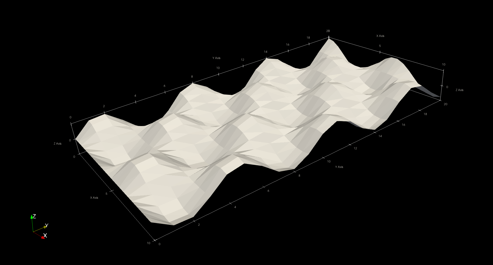
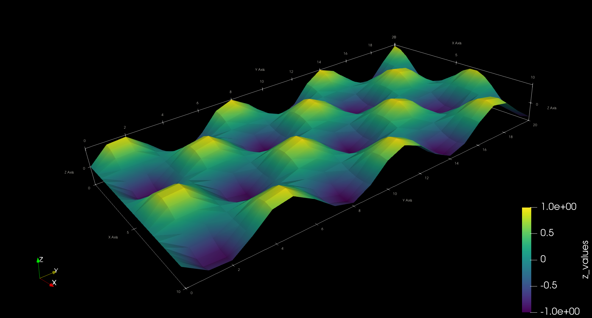

# Generating surface plots

Surface plots can be used to represent two-dimensional data.
WriteVTK includes the convenience function [`vtk_surface`](@ref) for
visualising surface plots via VTK files.
This works in a similar way to surface plots in many plotting packages, e.g.
[Makie](https://makie.juliaplots.org/stable/examples/plotting_functions/surface/).

## Basic usage

The `vtk_surface` function takes the coordinates `xs` and `ys` as well as the
heights `zs` of the data.
Other than that, it works in the same way as [`vtk_grid`](@ref):

```jldoctest surface
julia> using WriteVTK

julia> xs = 0:0.5:10; ys = 0:1.0:20;

julia> zs = @. cos(xs) + sin(ys');

julia> vtk = vtk_surface("surf", xs, ys, zs)
VTK file 'surf.vtu' (UnstructuredGrid file, open)

julia> close(vtk)
1-element Vector{String}:
 "surf.vtu"
```

This will generate a `surf.vtu` file (corresponding to a VTK unstructured grid)
ready to be visualised:



Note that the above example represents a regular 2D grid.
For irregular grids, it is also possible to pass `xs` and `ys` as matrices
instead of vectors.

## Attaching more data

In the above example, the dataset does not include any data that could be
readily used to colour the surface.
In surface plots, it is common to colour the surface by its own height.
This can be easily achieved by writing the `zs` matrix as point data when
creating the VTK file:

```jldoctest surface
julia> vtk_surface("surf2", xs, ys, zs) do vtk
           vtk["z_values"] = zs
       end
1-element Vector{String}:
 "surf2.vtu"
```



Above we have used the do-block syntax in the very same way it can be done with
[`vtk_grid`](@ref).
Of course, the same syntax can be used to add as many datasets as one wants.

For more details, see the [`vtk_surface`](@ref) documentation.
